## <span style="color:#7879f1"> **<i>Contents of Table</i>**

**<i><span style="color:#7879f1"> ▶︎ [INTRODUCE PROJECT](#-ICE-BREAKER-)</i>**

**<i><span style="color:#7879f1"> ▶︎ [DEVELOPMENT PLAN](#-DEVELOPMENT-PLAN)</i>**

**<i><span style="color:#7879f1"> ▶︎ [STACK](#-STACK)</i>**

**<i><span style="color:#7879f1"> ▶︎ [FEATURES](#-FEATURES)</i>**

**<i><span style="color:#7879f1"> ▶︎ [INSTALLATION](#-INSTALLATION)</i>**

**<i><span style="color:#7879f1"> ▶︎ [PROJECT LOG](#-PROJECT-LOG)</i>**

<br>

# <span style="color:#6bcdff"> **🧊 ICE BREAKER 🔨**

<p>
  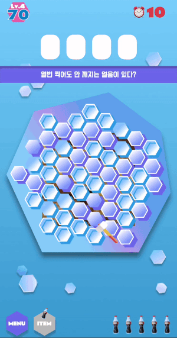
  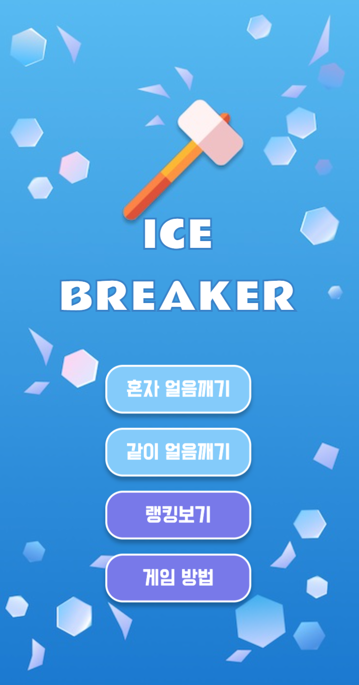
</p>

### **❄️ <i>Guess what's inside the ice!**</i>

**아이스 브레이커**는 망치로 얼음 큐브를 깨면서,
얼음 아래로 보이는 그림이 무엇인지 맞추는 **Web App 게임**입니다.

### **❄️ <i>Motivation**</i>

스크래치 북과, 펭귄 얼음깨기 보드게임에서 모티브를 얻어 기획한 **아케이드** 게입니다.
재밌는 시각적인 요소들을 즐기면서 누구나 쉽게 체험할 수 있도록 만들었습니다.

### ❄️ <i>**[Demo LINK](https://icebreaker.colki.me/)**</i>

<br>
<br>

# <span style="color:#7879f1">🗒 **DEVELOPMENT PLAN**

### **프로젝트 기간**

2021.9.27 ~ 2021.10.16 ( 3Week )

> 09.27 ~ 10.03 : 아이디어 기획 및 기능 정리 & 애자일 스프린트 계획<br />
> 10.04 ~ 10.16 : 개발 진행

<br>

### **프로젝트 준비**

- 🧠 [**Brain Storming**](https://www.notion.so/ideas-be87d168982e47688f7f3cb81f5a0e8d) : 프로젝트 아이디어

- **📝 [Features Planning](https://www.notion.so/features-08ed4725b3c345b9ab1bd94ecbdb658d)** : 프로젝트 기능 정리

- **🎨 [MockUp Figma](https://www.figma.com/file/tK8XW8HuDSSGUJU0p7KRhN/ICE-BREAKER?node-id=0%3A1)** : 프로젝트 목업 디자인

<br>

### **프로젝트 진행**

- Features : 프로젝트 세부 기능 기획

- MockUp by Figma : UI & UX 설계

- Kanban by Notion : Task 일정 분배

- Git Flow : 기능별 브랜치 Merge Strategy

<br>
<br>

# <span style="color:#7879f1"> **🕋 STACK**

**FrontEnd**

- JavaScript ES2015+
- React
- React-router-dom
- Redux (Redux-toolkit)
- Konva.js
- Gsap
- Styled-component

**BackEnd**

- Firebase Realtime Database
- Amazon S3

**ThirdParty Stack**

- Netlify
- Lodash
- React-fastclick
- Use-sound
- PropTypes
- Jest
- React-testing
- EsLint
- Git

<br>
<br>

# <span style="color:#7879f1">📸 **FEATURES**

```
🧊 얼음깨기 RULES
 ‣ Breaking Time 동안 최대한 많은 얼음을 깨야 합니다.
 ‣ Breaking Time이 끝나면 15초간 정답을 맞출 수 있습니다.
 ‣ 정답을 맞추면 바로 다음 문제로 넘어갈 수 있습니다.
 ‣ 레벨업 할 때마다 IceCube 의 난이도가 올라갑니다.
 ▾ 북극곰의 최애 콜라 아이템을 사용할 수 있습니다.
   ‣ 🥤 : 정답 입력 시간이 10초 연장됩니다.
   ‣ 🥤🥤 : 상대방의 정답 입력 시간을 5초 단축합니다.(같이 얼음깨기)
```

<br>

### **🧊🔨 혼자 얼음 깨기 : Solo Mode**

<div style="display: flex; text-align: center;">
  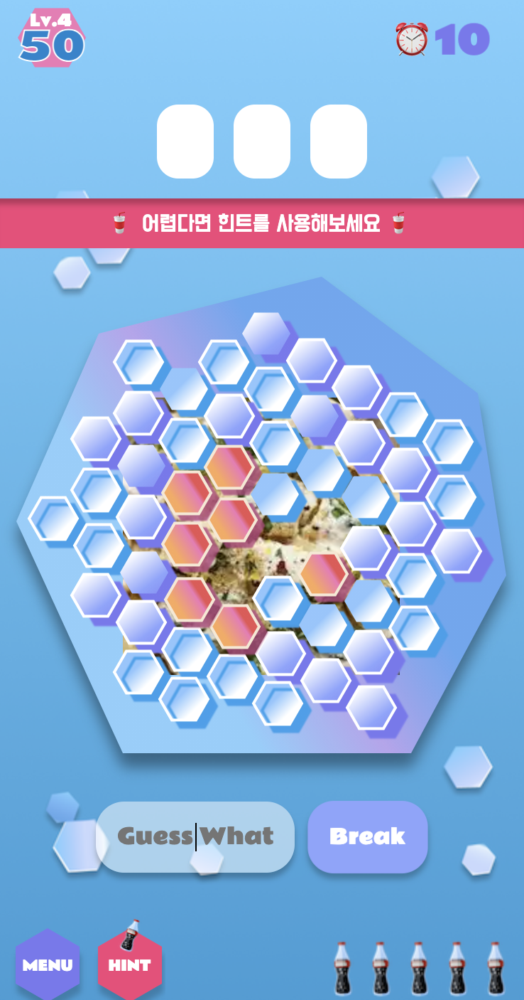
  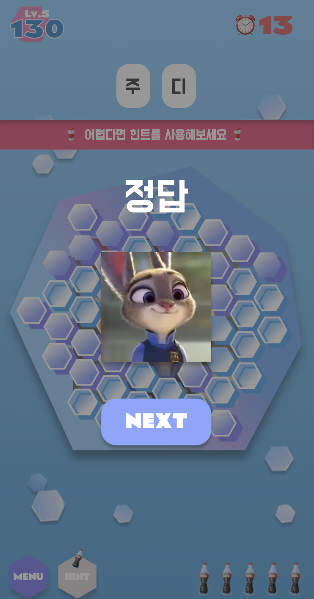
  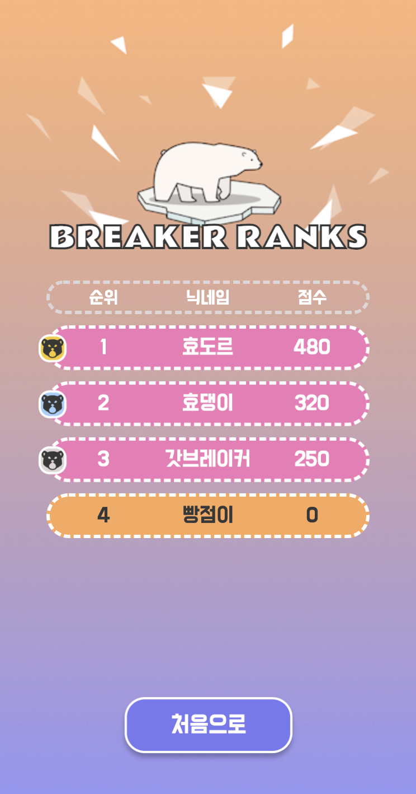
</div>

<br>

- 경쟁에 대한 부담없이 혼자서도 게임을 즐길 수 있습니다.
- **랭킹**에 점수를 등록해서 자신의 점수를 널리 자랑할 수도 있습니다.

<br>

### **🧊🔨 같이 얼음 깨기 : Battle Mode**

<div style="display: flex; text-align: center;">
  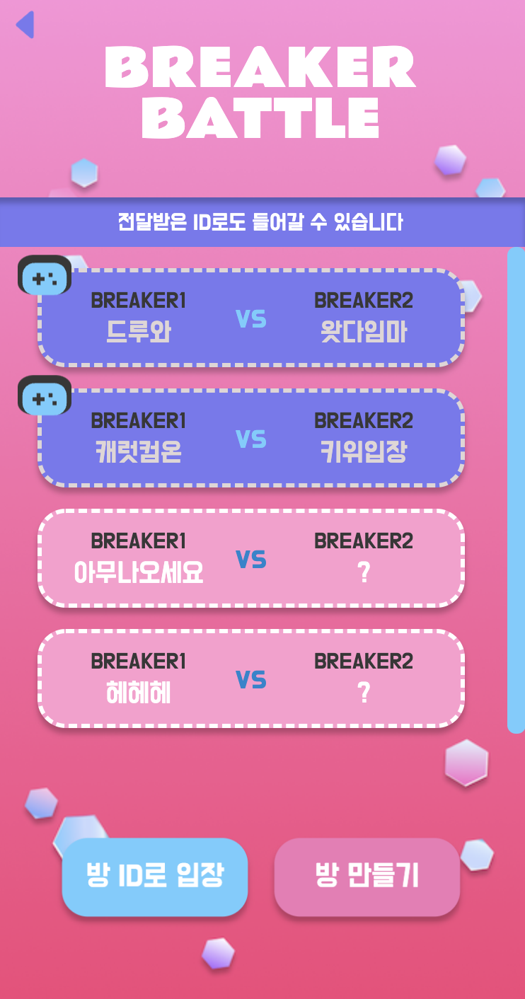
  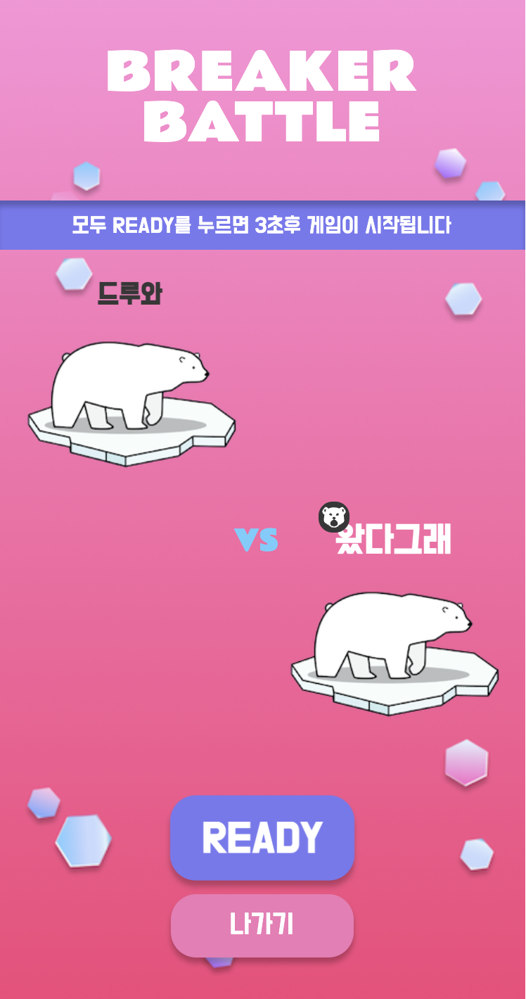
  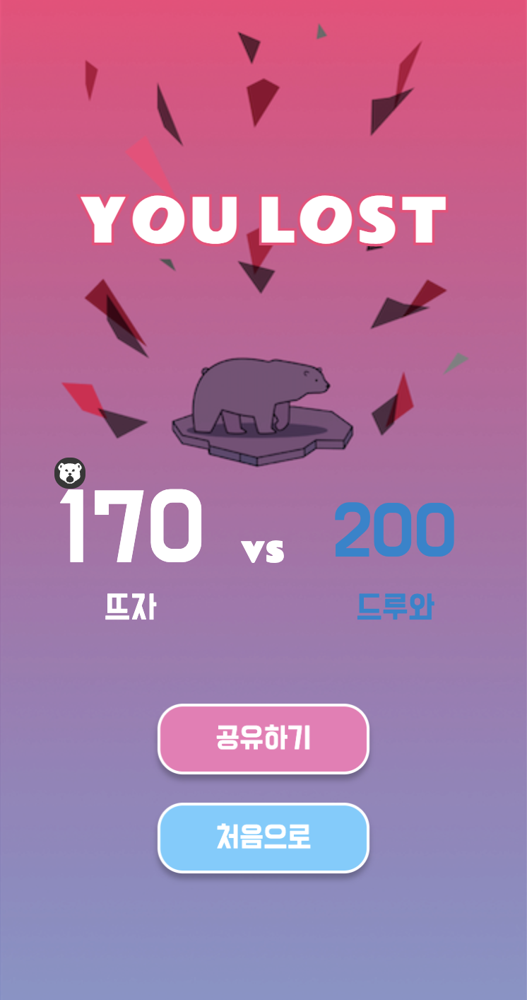
</div>
<div style="display: flex; text-align: center;">
  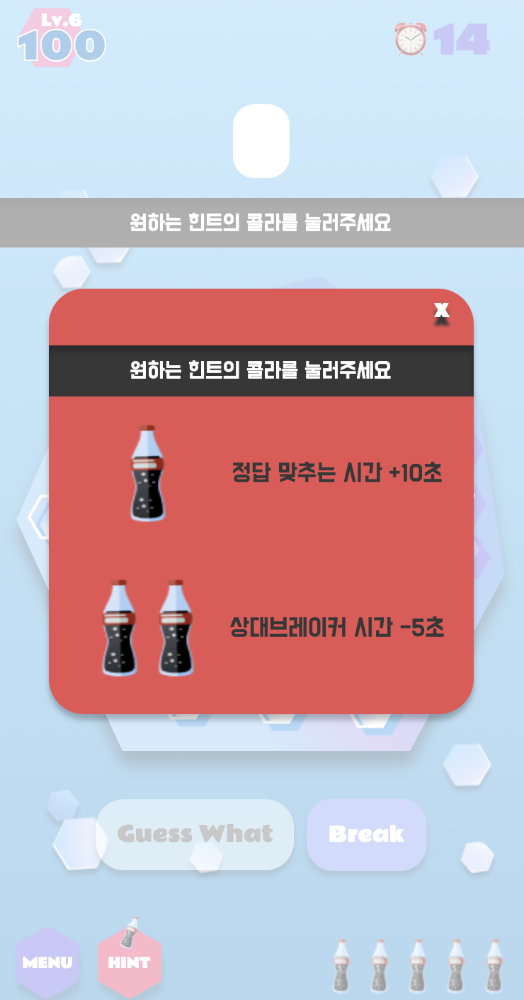
  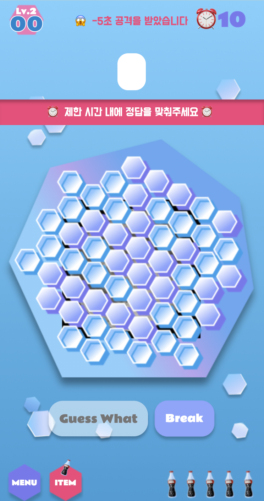
  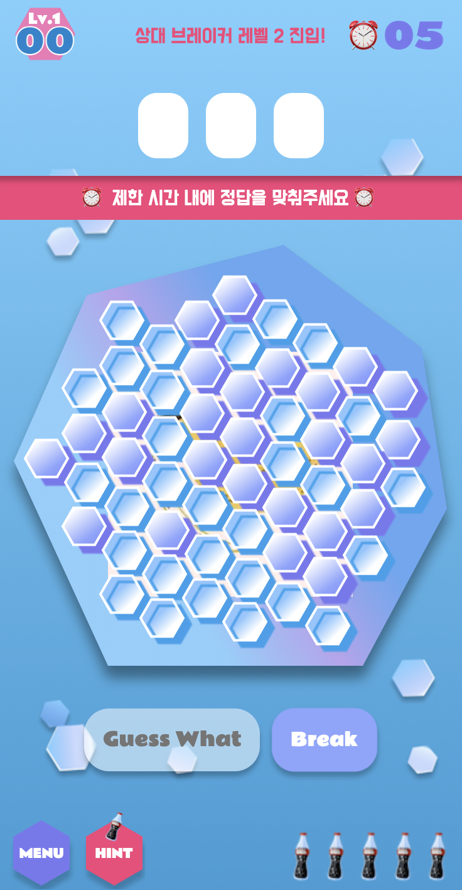
</div>

<br>

- **1 vs 1 매칭**으로 진행되며, 상대방이 다음 레벨로 넘어갈 때마다 알림이 뜨기 때문에 스릴을 느끼면서 긴장을 놓지 않고 얼음 깨기를 할 수 있습니다.
- 방 만들기
  방을 만들면 방 고유의 ID가 발급됩니다. 이 ID를 친구에게 공유할 수도 있습니다.
- 방ID로 바로 참여하기
  친구에게 전달받은 ID로 해당 방에 바로 입장할 수 있습니다.
- 둘 중 한 명이라도 마지막 레벨을 끝내는 순간 게임이 종료되며, 결과 화면에서 최종 점수와 승패를 확인할 수 있습니다.
  상대방이 다음 레벨로 넘어가거나, 상대방이 콜라 아이템으로 공격하면 **상단에 경고메시지**가 실시간으로 나타납니다.

<br>

🧊 **게임 방법 : How to Play**

- 아이스브레이커 게임 규칙에 대한 페이지입니다.

<br>
<br>

# <span style="color:#7879f1">🏗 **INSTALLATION**

- 프로젝트를 다운받은 후 프로젝트 디렉토리 내부에서 `.env` 파일을 생성하고, 다음 환경 변수를 입력해주세요
  ```jsREACT_APP_FIREBASE_API_KEY>
  REACT_APP_FIREBASE_AUTH_DOMAIN>
  REACT_APP_FIREBASE_DATABASE_URL>
  REACT_APP_FIREBASE_PROJECT_ID>
  REACT_APP_FIREBASE_STORAGE_BUCKET>
  REACT_APP_FIREBASE_MESSAGING_SENDER_ID>
  REACT_APP_FIREBASE_APP_ID>
  REACT_APP_ICE_BREAKER_URL=https://icebreaker.colki.me
  ```
- 프로젝트를 다운받은 뒤 프로젝트 디렉토리 내부에서 다음 command 를 입력해주세요

  ```js
  $ npm install
  ```

- 다음 command를 입력한 후 로컬환경에서 애플리케이션을 실행해주세요

  ```js
  $ npm start
  ```

  로컬 URL: `http://localhost:3000`

<br>
<br>

# <span style="color:#6bcdff">**📣 PROJECT LOG**

### **<i>🔹 Why Firebase?</i>**

- **firebase를 서버로 사용하게 된 이유**
  imgUrl과 answer로 이루어진 퀴즈데이터의 단순한 구조와, 보안과 관련된 개인 계정을 저장하지 않기 때문에 서버를 따로 만들지 않고 firebase를 이용하는 방향으로 결정했습니다.
  또한 socket.io로 구현했던 [**더빙게임 V-Live프로젝트**](https://github.com/voicelive)에 비해 실시간 소통의 비중이 상대적으로 적었고, 새로운 방식으로도 socket을 구현해보고 싶었기 때문에 **firebase** **realtime database**를 선택했습니다.

### **<i>🔹 Why Konva?</i>**

- **캔버스 라이브러리를 선택 과정**

  얼음판 위에 그려지는 작은 얼음 큐브 하나하나에 각각 클릭이벤트 및 애니메이션을 조작해줘야 했기 때문에 캔버스를 사용하기로 결정했습니다. HTML5에서 기본으로 제공해주는 canvas API 는 dom element 를 조작해서 그래픽을 구현하는 방식이었기 때문에, 리액트 기반인 아이스브레이커와는 맞지 않다 생각했습니다. 많은 라이브러리를 조사해보고 Fabric 과 p5 그리고 Konva 를 사용해본 끝에 라이브러리 찾기 유목 생활을 정리할 수 있었습니다.

- **React-Konva**

  Konva 깃허브 내부를 살펴봤을 때 리액트 컴포넌트를 상속받는 걸 확인했기 때문에, 기존 리액트를 다루듯이 작업할 수 있어서 이질감이 없었습니다.
  Konva 에서의 canvas 를 담당하는 Stage > Layer > Shape 구조로 레이어별로 나눠서 작업할 수 있고 레이어 순서를 변경하는 일도 용이했습니다. Fabric, P5 와 달리 JSX 에서 Shape 등을 정의함과 동시에 prop 으로 속성을 같이 넣어줄 수 있기 때문에 굉장히 직관적이고 코드도 가벼워졌습니다.

- **아쉬운 부분 💦**

  다만 캔버스와 엘리먼트간에는 각자 공간을 차지하고 있기 때문에 레이어처럼 쌓아 올려지지 않아서, 게임화면의 점수, 메뉴, 아이템에서 reflow 를 발생시킬 수 있는 스타일 속성들을 사용했던 부분이 있었습니다.
  <br>
  <br>

### **<i>🔸 Mobile Optimization 모바일 최적화</i>**

로컬 브라우저 환경과 달리 배포 후 모바일 환경에서 초기 렌더링 및 화면 전환시 네트워크 요청 속도가 느려지는 문제가 발생되어, 속도 향상에 중점을 두고 다양한 최적화 방법을 시도했습니다.<br>
( Web Inspector & LightHouse 테스트 → 퍼포먼스 성능 28% 향상 )

- **Code-Splitting**<br>React.lazy & React.Suspense 로 컴포넌트 지연 로딩 ‣ vendor.chunk 파일 Transfer 사이즈 85% 감소
- **Image**<br />저장소를 Firebase Storage 에서 S3로 변경 ‣ 네트워크 요청 시간 95% 단축<br>jpg, png, webp 각 이미지 형식으로 렌더링 속도 비교 후 webp 포맷 선택 ‣ 로딩 시간 4.3s 감소
- **Tree-Shaking**<br>Lodash ‣ 빌드시간을 고려하여 플러그인 없이 Default Import 방식으로 번들 사이즈 89% 감소 <br>트리셰이킹이 적용된 Firebase V9 SDK 사용 ‣ Database Module 번들 사이즈 60% 감소
- **Reflow 방지**<br>레이아웃 단계를 재발생 시키는 css 속성을 변경하여 Reflow 제거 및 최소화
- **React 최적화**<br>React Hooks API 를 적절하게 사용하여 불필요한 렌더링 방지
  <br>
  <br>

### **<i>🔸 CleanUp Error</i>**

게임 진행을 테스트하던 중 이미 언마운트 된 컴포넌트의 함수가 호출되는 버그를 발견했습니다. 해당 컴포넌트에서 퀴즈 데이터를 받아오는 Firebase 함수의 분기 처리만 바꿔줬던 부분이기 때문에 코드에서는 문제가 없다고 생각했습니다.

<details>
  <summary>분기처리 수정 전 후</summary>

<br>
roomId : URL의 파라미터, 배틀 모드일 때 존재하는 방 ID

<br>
<br>

**Before**

```js
useEffect(() => {
  if (roomId) {
    return onValue(ref(getDatabase(), ...), (snapshot) => {
      //do something
    });
  }

  dispatch(getFirstLevel());
}, [dispatch, roomId]);
```

**After**

```js
useEffect(() => {
  if (!roomId) dispatch(getFirstLevel());

  onValue(ref(getDatabase(), ...), (snapshot) => {
    //do something
  });
}, [dispatch, roomId]);
```

</details>
<br>

Firebase의 onValue 함수는 DB가 업데이트 되는지 계속해서 리스닝하는 메서드인데 return 을 해주는 방식에서, 분기 처리 수정 후에 return 되지 않으면서 발생한 이벤트 누수였습니다. Firebase 가 V9 SDK 문서에는 onValue 의 return 값에 대한 부분이 명시하지 않았기 때문에, 직접 <b>return 값</b> 을 확인한 후에 버그를 개선할 수 있었습니다.

```js
// onValue의 반환값
() => repoRemoveEventCallbackForQuery(query._repo, query, container);
```

리액트는 개발자가 의도했을 수 있기 때문에 메모리가 누수되더라도 별다른 조치를 하지 않는 다는 사실도 알게 되었고, 문서에만 의지하지 않고 근본적인 원리를 파고들어 문제를 해결하는 방법을 깨우치는 유익한 시간이었습니다.

<br>
<br>

### **<i>🔸 Realtime Battle Mode</i>**

처음 기획했던 아이스브레이커는 솔로 모드로만 진행되는 포맷이었습니다. 원래 계획대로라면 게임만들기 기능을 추가해야 했지만, **이렇게 재밌고 알찬 게임을** 혼자서만 즐기기에는 아깝다는 생각이 들어서 배틀 모드를 추가하게 되었습니다.

게임의 진행 상태를 명시한 State로 확장성과 유연성이 보장되도록 디자인했기 때문에, 이미 솔로 모드를 기반으로 구현된 로직에 다른 사용자와 게임하는 배틀 기능을 추가했음에도 불구하고 두 로직이 의존성없이 작동할 수 있었습니다.
