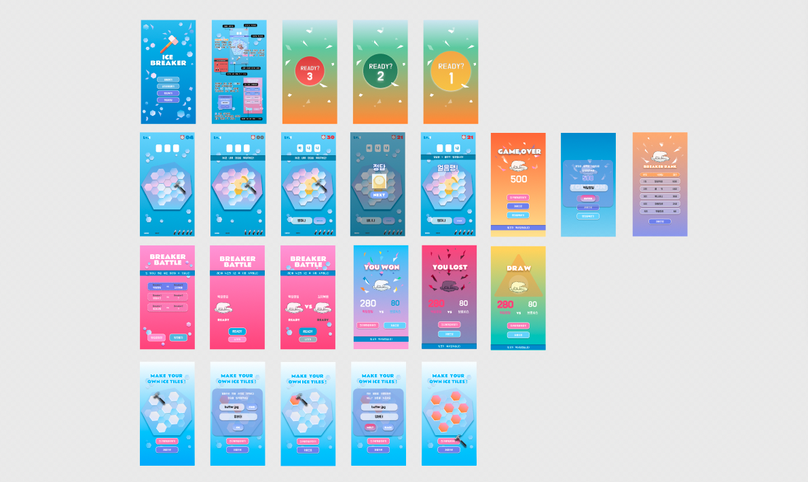
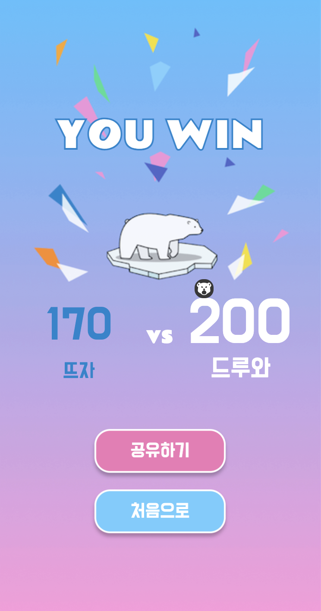

# <span style="color:#0285cf"> **🧊 ICE BREAKER**

<p>
  
  
</p>

## **<i>Guess what's inside the ice!**</i>

**아이스 브레이커**는 망치로 얼음 큐브를 깨면서🧊🔨<br>
얼음 아래로 보이는 그림이 무엇인지 맞추는 아케이드 **Web App 게임** 입니다.<br>
혼자 얼음을 깨거나 친구와 함께 경쟁하면서 얼음을 깰 수 있습니다.

<br>
<br>

# **<i>SHORTCUT</i>**

**<i>[🗒 DEVELOPMENT PLAN ](#-DEVELOPMENT-PLAN)</i>**

**<i>[🚀 MOTIVATION](#-MOTIVATION)</i>**

**<i>[📸 FEATURES](#-FEATURES)</i>**

**<i>[🧳 STACK](#-STACK)</i>**

**<i>[🕹 USAGE](#-USAGE)</i>**

**<i>[💾 DEPLOY](#-DEPLOY)</i>**

**<i>[📘 PROJECT LOG](#-PROJECT-LOG)</i>**

**<i>[⚒️ TECHNICAL CHALLENGE](#-TECHNICAL-CHALLENGE)</i>**

<br>
<br>

# **🗒 DEVELOPMENT PLAN**

### **프로젝트 기간**

- **2021.09.27 ~ 2021.10.03**

  아이디어 기획

  목업디자인

  세부 기능 설계

  애자일 스프린트 계획 (1주)

- **2021.10.04 ~ 2021.10.16**

  개발 진행 (2주)

<br>

### **프로젝트 진행단계**

- **프로젝트 아이디어 구상**

  - **[🧠 아이디어 리스트](https://www.notion.so/ideas-be87d168982e47688f7f3cb81f5a0e8d)**

- **UI / UX 사용자의 관점에서 생각한 UI 디자인 및 UI 기획**

  - **[📝 Features Planning](https://www.notion.so/features-08ed4725b3c345b9ab1bd94ecbdb658d)**

  - **[🎨 MockUp Figma](https://www.figma.com/file/tK8XW8HuDSSGUJU0p7KRhN/ICE-BREAKER?node-id=0%3A1)** : 프로젝트 목업 디자인
    

<br>

- **애자일 스프린트 방식의 태스크 매니지먼트**

- **기술 스택 검토**

- **기능별 브랜치 Git Merge Strategy**

- **Netlify 배포 및 모바일 테스트**

- **Unit Test Case 작성**

<br>
<br>

# **🚀 MOTIVATION**

어린 시절 검은색스케치북에 스크래치를 내서 무지개색으로 그림을 그리던 스크래치북에서 영감을 얻어서 조금씩 보이는 조각을 힌트로 그림을 맞추는 게임을 구상하게 되었습니다. <br> 그림을 그리는 것보다 더 유니크하고 재밌는 방식이 없을까 고민하던 중에 펭귄 얼음깨기 보드게임에서 모티브를 얻어서 얼음을 하나하나 망치로 깨서 들여다 보는 요소를 넣은 **🧊 ICE BREAKER🔨** 를 제작하게 되었습니다. <br>반짝이고 재밌는 시각적인 요소들을 즐기면서 누구나 쉽게 체험할 수 있도록 만들었습니다.

<br>
<br>

# **📸 FEATURES**

<div style="display: flex; text-align: center;">
  
  
  
  
</div>

<br>

- 솔로 모드( `혼자 얼음깨기` )와 배틀 모드( `같이 얼음깨기` ) 지원
- Gsap 를 이용한 준비 화면 화면전환시 클로즈업 애니메이션
- 브레이킹 타임 후 정답입력 시간 : 콜라 아이템 사용 기능
- 아이템1 : 사용자의 정답 입력 시간 10초 증가
- 아이템2 : 상대 사용자의 정답 입력 시간 5초 감소
- 게임 결과 화면 : 점수 확인 및 랭킹 등록 기능

<br>

<div style="display: flex; text-align: center;">
  
  
  
  
</div>

<br>

- Firebase Realtime Database 기반으로 소켓 기능 구현
- 채널 개설에 따른 실시간 채널리스트 업데이트
- 채널 ID 친구와 공유 및 ID 로 바로 입장
- 아이템을 이용한 유저의 정답시간 추가 및 상대 유저의 정답시간 단축 기능
- 상대유저의 다음 레벨 진입 또는 아이템 공격시 실시간 알림 기능
- 한 쪽에서 게임 종료시 게임 승패 결과 페이지 동시 이동

<br>
<br>

# **🧳 STACK**

_**FrontEnd**_

- JavaScript ES2015+
- React
- React Router Dom
- Redux (Redux-Toolkit)
- Styled-Component
- Konva.js
- Gsap

_**BackEnd**_

- Firebase Realtime Database
- Amazon S3

_**ThirdParty Stack**_

- Netlify
- Lodash
- React-Fastclick
- Use-Sound
- PropTypes
- Jest
- React Testing Library
- EsLint
- Git

<br>
<br>

# **🕹 USAGE**

- 프로젝트를 다운받은 후 프로젝트 디렉토리 내부에서 `.env` 파일을 생성하고, 다음 환경 변수를 입력해주세요
  ```jsREACT_APP_FIREBASE_API_KEY>
  REACT_APP_FIREBASE_AUTH_DOMAIN>
  REACT_APP_FIREBASE_DATABASE_URL>
  REACT_APP_FIREBASE_PROJECT_ID>
  REACT_APP_FIREBASE_STORAGE_BUCKET>
  REACT_APP_FIREBASE_MESSAGING_SENDER_ID>
  REACT_APP_FIREBASE_APP_ID>
  REACT_APP_ICE_BREAKER_URL=https://icebreaker.colki.me
  ```
- 프로젝트를 다운받은 뒤 프로젝트 디렉토리 내부에서 다음 command 를 입력해주세요

  ```js
  $ npm install
  ```

- 다음 command를 입력한 후 로컬환경에서 애플리케이션을 실행해주세요

  ```js
  $ npm start
  ```

  로컬 URL : `http://localhost:3000`

<br>
<br>

# **💾 DEPLOY**

- Netlify 를 이용한 배포 자동화
- <i>**[Demo LINK_ICE BREAKER ⚒️](https://icebreaker.colki.me/)**</i>

<br>
<br>

# **📘 PROJECT LOG**

### **<i>Why React?</i>**

- 프론트엔드 프레임워크 및 라이브러리 중에서 선언적인 방식으로 JSX를 UI를 렌더링할 수 있는 방식의 리액트를 선택했습니다. 라이브러리이기 때문에 다양한 모듈들을 커스터마이징해서 사용할 수 있고, 사용자와의 인터렉션 및 잦은 API 요청에 의한 무분별한 Reflow 와 불필요한 업데이트를 방지할 수 있었습니다. 컴포넌트를 분리함으로써 데이터를 필요한 위치에서만 관리할 수 있어서 상태 관리에 보다 더 집중할 수 있었습니다.

<br>

### **<i>Why Firebase?</i>**

- **firebase를 서버로 사용하게 된 이유**
  imgUrl과 answer로 이루어진 퀴즈데이터의 단순한 구조와, 보안과 관련된 개인 계정을 저장하지 않기 때문에 서버를 따로 만들지 않고 firebase를 이용하는 방향으로 결정했습니다.
  또한 socket.io로 구현했던 [**더빙게임 V-Live프로젝트**](https://github.com/voicelive)에 비해 실시간 소통의 비중이 상대적으로 적었고, 새로운 방식으로도 socket을 구현해보고 싶었기 때문에 **firebase** **realtime database**를 선택했습니다.

<br>

### **<i>Why Konva?</i>**

- **캔버스 라이브러리를 선택 과정**

  얼음판 위에 그려지는 작은 얼음 큐브 하나하나에 각각 클릭이벤트 및 애니메이션을 조작해줘야 했기 때문에 캔버스를 사용하기로 결정했습니다. HTML5에서 기본으로 제공해주는 canvas API 는 dom element 를 조작해서 그래픽을 구현하는 방식이었기 때문에, 리액트 기반인 아이스브레이커와는 맞지 않다 생각했습니다. 많은 라이브러리를 조사해보고 Fabric 과 p5 그리고 Konva 를 사용해본 끝에 라이브러리 찾기 유목 생활을 정리할 수 있었습니다.q

- **React-Konva**

  Konva 깃허브 내부를 살펴봤을 때 리액트 컴포넌트를 상속받는 걸 확인했기 때문에, 기존 리액트를 다루듯이 작업할 수 있어서 이질감이 없었습니다.
  Konva 에서의 canvas 를 담당하는 Stage > Layer > Shape 구조로 레이어별로 나눠서 작업할 수 있고 레이어 순서를 변경하는 일도 용이했습니다. Fabric, P5 와 달리 JSX 에서 Shape 등을 정의함과 동시에 prop 으로 속성을 같이 넣어줄 수 있기 때문에 굉장히 직관적이고 코드도 가벼워졌습니다.

- **아쉬운 부분**

  다만 캔버스와 엘리먼트간에는 각자 공간을 차지하고 있기 때문에 레이어처럼 쌓아 올려지지 않아서, 게임화면의 점수, 메뉴, 아이템에서 reflow 를 발생시킬 수 있는 스타일 속성들을 사용했던 부분이 있었습니다.

<br>

### **<i>Who are you ?</i>**

진부한 말일 수 있겠지만 사용자의 관점으로 애플리케이션과 서비스를 바라보고 이해하는 데에 남다른 통찰력이 있다고 자신있게 말할 수 있습니다. 사용자들은 보이지 않는 부분에서도 불편을 느끼고 또 지나칠 수 있는 부분에서는 세심한 배려와 센스를 느낍니다. 즐겨 찾는 사이트나 앱을 사용하면서 불편한 부분이나 개선했으면 하는 부분에 대해서 많이 생각하고 제안하는 등 액션을 취해왔습니다. 사용자로써 쌓아온 경험으로 이제 개발자의 경력을 시작하려고 합니다. 🏃🏻‍♀️

<br>
<br>

# **⚒️ TECHNICAL CHALLENGE**

### **<i>Mobile Optimization 모바일 최적화</i>**

로컬 브라우저 환경과 달리 배포 후 모바일 환경에서 초기 렌더링 및 화면 전환시 네트워크 요청 속도가 느려지는 문제가 발생되어,<br>속도 향상에 중점을 두고 다양한 최적화 방법을 시도했습니다.<br>
( Web Inspector & LightHouse 테스트 → 퍼포먼스 성능 28% 향상 )

- **Code-Splitting**<br>React.lazy & React.Suspense 로 컴포넌트 지연 로딩 ‣ vendor.chunk 파일 Transfer 사이즈 85% 감소
- **Image**<br />저장소를 Firebase Storage 에서 S3로 변경 ‣ 네트워크 요청 시간 95% 단축<br>jpg, png, webp 각 이미지 형식으로 렌더링 속도 비교 후 webp 포맷 선택 ‣ 로딩 시간 4.3s 감소
  - Imagine Webp 플러그인으로도 webp 형식으로 변환이 가능했지만, 프로젝트 특성과 하나의 이미지를 계속적으로 변환하지 않아도 되기 때문에 굳이 무거운 모듈을 추가하여 빌드시간을 늘릴 필요가 없다고 판단하여 CLI 를 이용해서 직접 변환하는 방식을 채택했습니다.
- **Tree-Shaking**<br>트리셰이킹이 적용된 Firebase V9 SDK 사용 ‣ Database Module 번들 사이즈 60% 감소<br>Lodash ‣ 빌드시간을 고려하여 플러그인 없이 Default Import 방식으로 번들 사이즈 89% 감소 <br>
  - Lodash-es 버전을 사용했을 때 얻는 빌드 사이즈를 비교했을 때 실질적으로 차이가 없었습니다. Babel-plugin을 추가한다면 기존 Default Import 방식보다 13%가 감소하지만, 플러그인으로 인해 빌드시간이 증가하기 때문에 시간과 비용적으로 좋지 않다고 생각했습니다.
- **Reflow 방지**<br>레이아웃 단계를 재발생 시키는 css 속성을 변경하여 Reflow 제거 및 최소화
- **React 최적화**<br>React Hooks API 를 적절하게 사용하여 불필요한 렌더링 방지

<br>

### **<i>CleanUp Error</i>**

게임 진행을 테스트하던 중 이미 언마운트 된 컴포넌트의 함수가 호출되는 버그를 발견했습니다. 해당 컴포넌트에서 퀴즈 데이터를 받아오는 Firebase 함수의 분기 처리만 바꿔줬던 부분이기 때문에 코드에서는 문제가 없다고 생각했습니다.

<details>
  <summary>분기처리 수정 전 후 & 반환값 확인</summary>

roomId : URL의 파라미터, 배틀 모드일 때 존재하는 방 ID

**Before**

```js
useEffect(() => {
  if (roomId) {
    return onValue(ref(getDatabase(), ...), (snapshot) => {
      //do something
    });
  }

  dispatch(getFirstLevel());
}, [dispatch, roomId]);
```

**After**

```js
useEffect(() => {
  if (!roomId) dispatch(getFirstLevel());

  onValue(ref(getDatabase(), ...), (snapshot) => {
    //do something
  });
}, [dispatch, roomId]);
```

**onValue의 반환값**

```js
() => repoRemoveEventCallbackForQuery(query._repo, query, container);
```

</details>

Firebase의 onValue 함수는 DB가 업데이트 되는지 계속해서 리스닝하는 메서드인데 return 을 해주는 방식에서, 분기 처리 수정 후에 return 되지 않으면서 발생한 이벤트 누수였습니다. Firebase 가 V9 SDK 문서에는 onValue 의 return 값에 대한 부분이 명시하지 않았기 때문에, 직접 <b>return 값</b> 을 확인한 후에 버그를 개선할 수 있었습니다.
리액트는 개발자가 의도했을 수 있기 때문에 메모리가 누수되더라도 별다른 조치를 하지 않는 다는 사실도 알게 되었고, 문서에만 의지하지 않고 근본적인 원리를 파고들어 문제를 해결하는 방법을 깨우치는 유익한 시간이었습니다.

<br>

### **<i>Realtime Battle Mode</i>**

처음 기획했던 아이스브레이커는 솔로 모드로만 진행되는 포맷이었습니다. 원래 계획대로라면 게임만들기 기능을 추가해야 했지만, **이렇게 재밌고 알찬 게임을** 혼자서만 즐기기에는 아깝다는 생각이 들어서 배틀 모드를 추가하게 되었습니다.
게임의 진행 상태를 명시한 Game Status State로 확장성과 유연성이 보장되도록 디자인했기 때문에, 이미 솔로 모드를 기반으로 구현된 로직에 다른 사용자와 게임하는 배틀 기능을 추가했음에도 불구하고 두 로직이 의존성없이 작동할 수 있었습니다.
